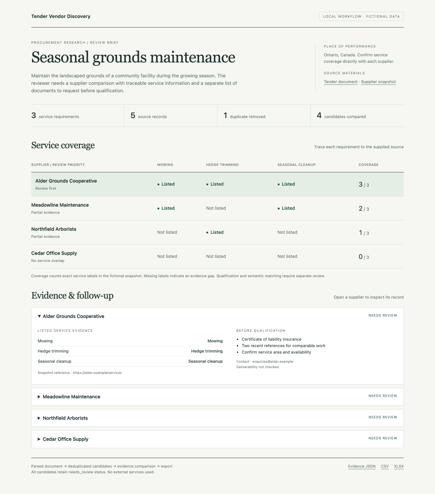
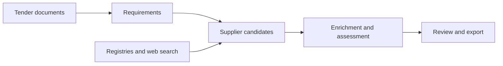

# Tender Vendor Discovery

Procurement research pipeline that turns tender documents into structured requirements,
discovers potential suppliers, and assembles company information for review.
Python · SQLAlchemy · Streamlit · registry and web-search adapters.

[Architecture](docs/ARCHITECTURE.md) · [Run locally](docs/USAGE.md) ·
[Example](examples/demo/README.md) · [Tests](docs/TESTING.md) · [Data](docs/DATA.md)



## Quick start

Python 3.11 and Poetry 2.1.4. The local example needs no credentials or external services.

```bash
git clone https://github.com/dariapavlova02/tender-vendor-discovery.git
cd tender-vendor-discovery
poetry install --with dev
make demo
```

Open `outputs/demo/review.html` in a browser. The example parses a tender document,
compares its service checklist with a fictional supplier snapshot, removes a duplicate,
and produces an evidence report plus JSON, CSV and XLSX exports.

The included enquiry has three requested services and two qualification documents.
Five source records become four unique candidates: the report shows full, partial and
missing service coverage, with source references and follow-up questions. Its transparent
service-label comparison runs locally; live processing uses the separate matching adapter.
See the [inputs and output contract](examples/demo/README.md).

## How it works



- **Document processing:** text sections, tables and optional OCR, combined with tender metadata.
- **Discovery:** adapters for SAM.gov, Canadian procurement datasets, Apollo and Serper;
  duplicate, geographic and eligibility checks.
- **Enrichment:** website content, contacts and contract history, with caching and batch processing.
- **Review:** source references, score origin and contact provenance travel with each result.
  Heuristic fallback results stay in the review queue.

## Engineering details

| Concern | Implementation |
| --- | --- |
| Persistence | SQLAlchemy models and Alembic migrations; SQLite or PostgreSQL |
| Repeat imports | Completed Canada CSV chunks recorded transactionally with updates |
| Candidate consistency | Additional discovery results pass through filtering before enrichment |
| Resumption | Candidate cache keyed by tender profile and discovery/filter settings |
| Attachments | Isolated files, bounded downloads, timeouts and reported failures |
| Reviewability | Score origin, review state and contact provenance included in exports |
| Inspection | Portable local review report; Streamlit workspace for configured integrations |

Code entry points and processing boundaries are documented in [Architecture](docs/ARCHITECTURE.md).

## Verification

```bash
make check
```

Runs the offline tests, validates Python syntax and documentation links, and builds the
package. Tests block network connections and use fake provider responses and disposable
SQLite databases. See [Testing](docs/TESTING.md) for the checked scope.

## Context and scope

Originally developed as a commercial procurement-research prototype, now maintained as
a portfolio project with a reproducible local workflow. The example uses authored data
and measures explicit service coverage, not supplier recommendation quality. Live integrations
and LLM output quality have not been re-evaluated for this edition; qualification decisions
need human review.

The Streamlit workflow requires Google OAuth configuration. Public multi-user deployment
is outside the verified scope. [Data notes](docs/DATA.md) cover source provenance and import
boundaries; [Contributing](CONTRIBUTING.md) covers local development.
