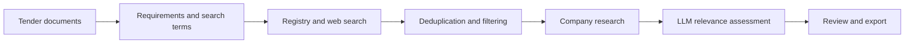

# Tender Vendor Discovery

Supplier research system developed and used in production for a commercial procurement
workflow. It reads tender documents, builds a candidate pool from registries and web
search, collects company information, and ranks suppliers against the tender requirements.

The default analysis limit is **500 candidate companies per run**. This is the pool entering
enrichment and assessment; the final shortlist depends on available information and relevance.

Python · Streamlit · SQLAlchemy · PostgreSQL / SQLite · OpenAI · Serper

[Architecture](docs/ARCHITECTURE.md) · [Run locally](docs/USAGE.md) ·
[Sources and data](docs/DATA.md) · [Tests](docs/TESTING.md)

## Workflow



1. **Read the tender.** Extract text and tables from PDF, Word and spreadsheet files,
   with OCR for scanned PDFs. Build a structured profile containing the scope, technical
   requirements, location, industry codes and supplier search terms. Tender metadata and
   attachments can also be retrieved through SAM.gov or CanadaBuys ingestion.
2. **Find candidates.** Search compatible sources using industry codes, keywords and
   location. Combine registry records with web results and optionally add Apollo candidates.
3. **Prepare the analysis pool.** Merge duplicates, apply eligibility checks, rank by
   geography and preliminary company signals, and retain up to the configured limit.
4. **Collect company information.** Retrieve website text, contact details and available
   contract-history metadata. Missing websites can be searched through DuckDuckGo and Serper.
5. **Assess relevance.** Send the tender summary and captured website content to an LLM
   to produce a score and rationale. Candidates without website content do not receive
   an LLM assessment. Heuristic fallback results remain marked for review.
6. **Review and export.** Inspect candidates in Streamlit and export results as CSV,
   XLSX or JSON, including source references, score origin and contact provenance.

## Information sources

| Source | Information used | Connection |
| --- | --- | --- |
| SAM.gov | US entity records, NAICS codes, locations and available business contacts | Entity API; source selected from the tender profile |
| Canadian procurement and business records | Supplier identities, GSIN/UNSPSC codes, locations and historical contract totals | Locally imported SQL database; data must be supplied separately |
| Serper | Candidate companies, website URLs, search snippets and place listings | Search API; Places search is the default discovery mode |
| Company websites | Descriptions of products/services, email addresses and phone numbers | HTML extraction, with a Playwright fallback |
| DuckDuckGo + Serper | Website lookup when a supplier record has no usable website | Optional website enrichment; enabled by the dashboard's Standard preset |
| Apollo | Additional companies and optional manual company/contact enrichment | Optional API integration |

Source registration and feature switches are documented in [Architecture](docs/ARCHITECTURE.md).
Having an adapter in the repository does not mean every source is queried on every run.

## Running the project

Use Python 3.11 and Poetry 2.1.4:

```bash
git clone https://github.com/dariapavlova02/tender-vendor-discovery.git
cd tender-vendor-discovery
poetry install --with dev
cp .env.example .env
```

Configure provider credentials and, for Canadian registry discovery, import the source data.
Then process a tender through the CLI:

```bash
poetry run tender-vendor-discovery run /path/to/tender.pdf \
  --no-auto-ingestion --output-dir outputs/review
```

Alternatively, configure Google OAuth and run `make dashboard` for the Streamlit workflow.
See [Run locally](docs/USAGE.md) for setup, imports and the differences between CLI defaults
and dashboard presets. Processing uses the configured external APIs.

## Implementation

- Separate ingestion, discovery, enrichment and assessment modules with shared data models.
- SQLAlchemy storage and Alembic migrations; transactional replay protection for Canada CSV imports.
- Asynchronous enrichment, streaming batches and background dashboard workers.
- Candidate and website caches; bounded attachment downloads and isolated upload storage.
- Offline tests for adapters, filtering, scoring responses, persistence and export contracts.

```bash
make check
```

Runs the maintained offline suite, documentation checks and package build. It also checks
the packaged CLI, parser and exporters outside the checkout with network access blocked.

## Scope and current limitations

The system was used in production; the current repository documents its implementation
and includes subsequent maintenance changes. Historical deployment does not establish
current API compatibility or measured recommendation accuracy.

Discovery and assessment share a candidate limit: the system does not keep searching
until it has 500 qualified suppliers. Missing websites, failed captures, source coverage
and relevance filtering can substantially reduce the final list. The current selection
threshold is a ranking rule, not a probability or qualification guarantee.

Client tender packages and production results are not included. [Data](docs/DATA.md)
describes retained source metadata, and [Testing](docs/TESTING.md) records the verification scope.
