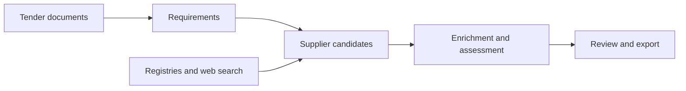

# Tender Vendor Discovery

Procurement research pipeline that turns tender documents into structured requirements,
discovers potential suppliers, and brings company information together for review.
Built with Python, SQLAlchemy and Streamlit, with adapters for government registries,
web search and LLM-assisted extraction.

[Architecture](docs/ARCHITECTURE.md) · [Run locally](docs/USAGE.md) ·
[Example output](examples/demo/README.md) · [Tests](docs/TESTING.md) · [Data](docs/DATA.md)

## Quick start

Requires Python 3.11 and Poetry 2.1.4. The example runs locally without credentials,
a database server, a browser installation or LLM calls.

```bash
git clone https://github.com/dariapavlova02/tender-vendor-discovery.git
cd tender-vendor-discovery
poetry install --with dev
make demo
```

The demo exports one fictional supplier record to `outputs/demo/` as JSON, CSV and XLSX.
It exercises the real export code using authored data; it does not perform discovery
or measure matching quality. See the [example](examples/demo/README.md) for the input
and expected output. To process your own documents with external providers, see
[Run locally](docs/USAGE.md).

## How it works



- **Document processing:** section extraction, table handling and optional OCR;
  requirements are combined with tender metadata where available.
- **Discovery:** source adapters for SAM.gov, Canadian procurement datasets,
  Apollo and Serper, followed by geographic and eligibility checks.
- **Enrichment:** website content, company contacts and contract-history context,
  with caching and asynchronous batch processing.
- **Review:** scored candidates retain source references and contact provenance.
  Heuristic fallback results remain review candidates instead of entering the shortlist.

## Example output

An illustrative grounds-maintenance enquiry shows the shape of a review record:

| Field | Example |
| --- | --- |
| Supplier | Example Grounds Services — fictional |
| Requirement | Mowing and seasonal grounds cleanup |
| Available information | Example service description and company contact |
| Still to check | Insurance coverage and service area |
| Review state | `needs_review` |
| Source | `illustrative_fixture` |

The [JSON example](examples/demo/vendor_matches.json) also contains the score origin,
contact validation state and source references. Example scores are authored values,
not measured results. Real outputs depend on the configured sources and available evidence.

## Engineering details

| Concern | Implementation |
| --- | --- |
| Source integration | Separate ingestion, discovery and enrichment adapters |
| Persistence | SQLAlchemy models and Alembic migrations; SQLite or PostgreSQL |
| Repeat imports | Completed Canada CSV chunks recorded in the same transaction as updates |
| Candidate consistency | Additional discovery results pass through filtering before enrichment |
| Resumption | Candidate cache keyed by tender profile and discovery/filter settings |
| Reviewability | Score origin, review status and contact provenance carried into exports |
| Local inspection | Streamlit dashboard with intermediate data and background workers |

Code entry points and processing boundaries are documented in [Architecture](docs/ARCHITECTURE.md).

## Verification

```bash
make check
```

Runs the offline test suite, validates Python syntax and local documentation links,
and builds the Python package. Network connections are blocked during tests; provider
responses are mocked and database tests use disposable SQLite instances. These checks
verify software behaviour, not the accuracy of live supplier recommendations.
See [Testing](docs/TESTING.md) for scope.

## Project context and limitations

Originally developed as a commercial prototype for procurement research. This edition
focuses on a readable implementation, reproducible local examples and inspection of results.

- Supplier relevance and contact completeness depend on source coverage; recommendations
  require human review. Matching scores are ranking signals, not probabilities.
- Live integrations and LLM output quality have not been re-evaluated for this edition.
- Client tender packages, credentials and operational run files are not distributed in
  the current repository tree. The included example is fictional.
- The dashboard retains the original integration workflow and requires Google OAuth
  configuration. Public hosting and concurrent-user operation are outside this edition's checks.

[Data notes](docs/DATA.md) describe retained source metadata and import limitations.
[Contributing](CONTRIBUTING.md) describes local development.
